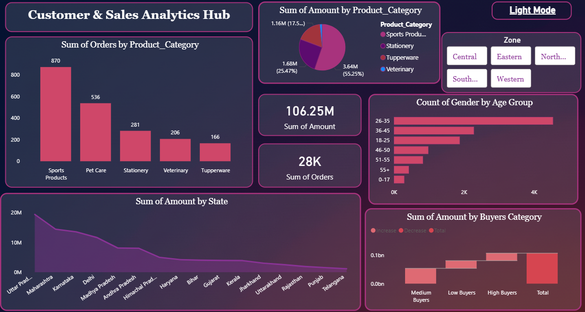

# 📊 Sales and Customer Analysis - Power BI

## 🔹 Project Overview
This project is an interactive Power BI dashboard designed to analyze sales performance and customer insights. It helps in understanding revenue trends, profit distribution, and customer behavior.

## 🔹 Objectives
- Analyze total sales and profit performance
- Identify top-performing products and regions
- Study customer purchasing patterns
- Track monthly and yearly growth trends

## 🔹 Tools Used
- Power BI
- DAX
- Data Modeling
- Excel (for dataset)

## 🔹 Key Features
- Sales & Profit Overview
- Region-wise Analysis
- Customer Segmentation
- Monthly Trend Analysis
- Interactive Filters (Slicers)

## 🔹 Dashboard Preview

## 🔹 Key Insights
- Identified top revenue-generating regions
- Found most profitable customer segments
- Analyzed seasonal sales fluctuations
